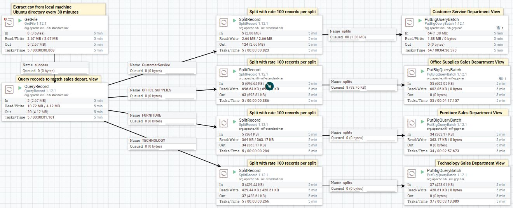

# Create ETL Pipleline Using Apache NiFi Workflow

## By Ramy Gendy

Automated extraction till loading in Google Cloud Platform(GCP).

## Introduction

* Design an automated the dataflow between software systems (Auto generated csv files on local machine to Cloud).
* Following is a step by step guide for building a ETL pipeline for extraction of data from local machine, transform data to the desired view/output, finally load specified different views in GCP.

## Dependencies

## Target

* Our Target is a shopping csv dataset.
* It is required to build an ETL pipeline to extract customer shopping data from provided shopping_dataset.csv.
* The targeted departments that are requesting these data are:

1. Customer Service Department:
   * This department requires all the data related to the shopping cart for each user/customer with all of the related data .
   * This department is allowed to view all the customer PII data.
2. Sales department:
   * This department requires all the data related to the shopping cart for each user/customer with all of the related data .
   * This department is allowed to view all the customer PII data.
   * There's a separate sales department per category.
   * This department is not allowed to view or access any PII data.

* A total of 3 sales department is required.
* All of the data extraction and transformation would be implemented using Apache NiFi.
* The pipeline should trigger at the 30th minute of every hour to extract a new batch of data.
* Then the data will be ingested to GCP BigQuery (preferred) or any Database.
* In the end you're required to deliver for each customer/department one consolidated view according to the department data requirements mentioned above.
* Feel free to create multiple data layers if needed for any data modelling.
* **Bonus**: create & generate new data with the same dataset schema (using any tool/language) and extract the new batch of generated data via NiFi at the 30th minute of every hour.

## Deliverables

* The XML file of the implemented NiFi pipeline (download as Template)

* Screenshots of the implemented NiFi pipeline with all processors' configurations.

## Dataset

* [shopping_dataset.csv](shopping_dataset.csv)

## Where to start

* [Workflow Design](WorkflowDesign.md): Start directly with the project for a step by step design.
* [Apache NiFi](https://www.tutorialspoint.com/apache_nifi/index.htm): Start a tutorial of NiFi tools.
* [EDA Shopping Dataset](EDA_shopping_dataset.ipynb): For a quick exploratory analysis of the dataset.

## Author

* [Ramy Gendy.](https://github.com/RamyGendy)
