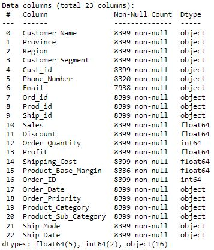

# Getting Started

* To start we first need to understand the dataset and the target/required problem that we trying to solve.
* With an [EDA (Exploratory Data Analysis)](EDA_shopping_dataset.ipynb) using python v3.8 on jupyter notebook to investigate the dataset that summaries the following:
  * Dataset shape: 8399 rows and 23 columns.
  * Datatypes:
    * 5 columns with float64 values.
    * 2 columns with integer64 values.
    * 16 columns with string values.

    

* So our first step is **Extraction**, which means importing the dataset and start reading it with valid schema.
* this can be done by using **GetFile** processor that will not only read the file to our workflow, but also we can set a timer( or set time) when to extact those files and which files exactly by setting up [_Regex Expression_](https://github.com/ziishaned/learn-regex/blob/master/README.md) to match our records.
* Our Regex expression will be: `^shopping_dataset[0-9]*\.csv$`
* Next step, is the **Transformation** where we query and match the view to its relative department.
* to atchive this we use **QueryRecord** Processor to query records by reading and writing with service controllers _**CSVReader**_ & _**CSVRecordSetWriter**_, to match each department view with the following _SQL queries_:
  1. Customer Service view:

      ```sql
      SELECT * FROM FLOWFILE WHERE Product_Category= 'OFFICE SUPPLIES'
      ```

  2. Sales Office Supplies view:

      ```sql
      SELECT Ord_id, Prod_id, Ship_id, Sales, Discount, Order_Quantity, Profit, Shipping_Cost, Product_Base_Margin, Order_ID, Order_Date, Order_Priority, Product_Sub_Category, Ship_Mode, Ship_Date FROM FLOWFILE WHERE Product_Category = 'OFFICE SUPPLIES'
      ```

  3. Sales Furniture view:
  
      ```sql
      SELECT Ord_id, Prod_id, Ship_id, Sales, Discount, Order_Quantity, Profit, Shipping_Cost, Product_Base_Margin, Order_ID, Order_Date, Order_Priority, Product_Sub_Category, Ship_Mode, Ship_Date FROM FLOWFILE WHERE Product_Category = 'FURNITURE
      ```
  
  4. Sales Technology view:
  
      ```sql
      SELECT Ord_id, Prod_id, Ship_id, Sales, Discount, Order_Quantity, Profit, Shipping_Cost, Product_Base_Margin, Order_ID, Order_Date, Order_Priority, Product_Sub_Category, Ship_Mode, Ship_Date FROM FLOWFILE WHERE Product_Category = 'TECHNOLOGY’
      ```

* Before jumping to Loading phase, it is recommeded to study and understand the platform that will digest the data will be. By putting in consideration, digestion size, load/export schema, authentication
* For this we will use **SplitRecord** Processor that will be added to each view to divide records into 100 records per split to be ingested into GCP big query by the same rate with controller service CSVReader and CSVRecordSetWriter. **Note** this method will not be efficient when dealing with very large data.
* Finally, **Loading** stage of transformed data to **PutBigQueryBatch** for each _split/view_ is uploaded to the server and supported with table schema presented [_Customer Service View Schema_](CustomerServiceViewSchema.JSON) & [_Sales View Schema_](SalesViewSchema.JSON)
* GCP is accessed via provided _private key_ on controller service **_GCPCredentialsControllerService_** in the _service account JSON property_.
